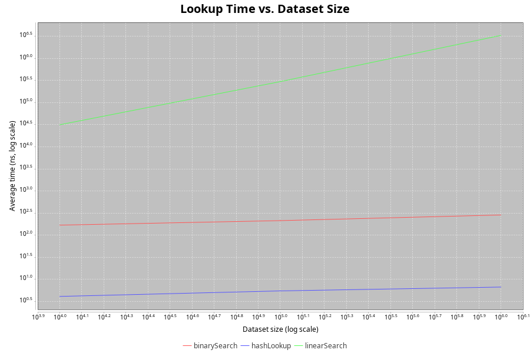

# Algorithm Cost Lab

## The Question

How much does an algorithmic choice matter when the amount of data grows?

## The Problem

A backend service needs to check whether a user ID exists in a large
collection of users before processing a request. This project answers
one question with an actual experiment: does the lookup strategy you
pick matter once the dataset gets big?

Think of it like choosing how to find a name in a phone book. Flip
page by page (linear search), or open to the middle and narrow down
each time (binary search), or use an index that jumps straight to the
name (hash lookup). All three "work." They do not all take the same
time once the book has a million names.

## The Implementations

Three approaches to the same lookup, side by side:

| Approach      | Time          | Extra space   |
|---------------|---------------|---------------|
| Linear Search | O(n)          | O(1)          |
| Binary Search | O(log n)      | O(1)          |
| HashSet Lookup| O(1) average  | O(n)          |

## The Theory

- **Linear search** checks IDs one by one. Doubling the dataset roughly
  doubles the worst-case work.
- **Binary search** needs a sorted collection. It halves the search
  space on each step, so doubling the dataset adds only one more step.
- **HashSet lookup** computes a hash and jumps to the right bucket.
  Lookup time stays roughly flat as the dataset grows, but it needs
  space proportional to the number of entries.

This is a real trade-off, not a free win: HashSet trades memory for
speed.

## The Experiment

Benchmarks run with JMH (Java Microbenchmark Harness), not
`System.nanoTime()` and not HTTP request timing. HTTP timing would mix
in Spring, networking, and JVM warm-up noise that has nothing to do
with the algorithm itself. JMH isolates the actual computation.

Spring Boot exposes the experiment through a REST endpoint. The
benchmark logic runs directly against the Java implementations,
independent of the web layer.

```
GET /api/benchmark?size=1000000
```

Dataset sizes tested: 10,000 / 100,000 / 1,000,000 (10,000,000 if the
machine handles it without memory issues).

Note: the REST endpoint above and the raw `results/benchmark.json`
file are not the same shape. JMH writes its own detailed schema to
`benchmark.json` (per-benchmark `params`, `primaryMetric`, raw
iteration data, and more). `BenchmarkService` reads that file and
reformats it into the simpler `{ datasetSize, results: [...] }` shape
shown above for the API response.

## Architecture

```
Client
  │
  ▼
Spring Boot REST API
  │
  ▼
Benchmark Service
  │
  ▼
JMH Benchmark
  │
  ├── Linear Search   O(n)
  ├── Binary Search   O(log n)
  └── HashSet Lookup  O(1) avg
  │
  ▼
Benchmark Results
```

## Results

Measured with JMH (3 warmup + 5 measurement iterations, average time
mode), taken directly from `results/benchmark.json`.

| Dataset Size | Linear (ns) | Binary (ns) | HashSet (ns) |
|--------------|-------------|-------------|--------------|
| 10,000       | 27,670.73   | 148.65      | 3.98         |
| 100,000      | 305,835.61  | 182.46      | 5.38         |
| 1,000,000    | 3,322,690.30| 219.52      | 6.74         |

From 10K to 1M (a 100x increase in dataset size):

- **Linear search** got about **120x slower** — consistent with O(n).
- **Binary search** got about **1.5x slower** — consistent with O(log n),
  since log₁₀(1,000,000) / log₁₀(10,000) = 6/4 = 1.5.
- **HashSet lookup** got about **1.7x slower** — theory predicts O(1),
  roughly flat. See the note under Trade-offs below on why it isn't
  perfectly flat in practice.

### Performance Chart
  

`results/performance.png` plots all three on a log-log scale (both
axes logarithmic). Linear search's O(n) shows as a straight diagonal
line. Binary search's O(log n) is a visibly bending curve, not a
straight line — that bend is the actual mathematical signature of
logarithmic growth. HashSet stays near-flat by comparison.

## The Trade-offs

Faster is not automatically better. HashSet wins on time but costs
O(n) extra memory. Binary search is a solid middle ground on time but
requires the data to be sorted first, which has its own cost. Linear
search needs no setup at all, which matters for small or one-off
lookups.

**A note on HashSet's numbers specifically:** the measured lookup time
went from 3.98 ns to 6.74 ns as the dataset grew from 10K to 1M — not
perfectly flat, even though the theoretical average is O(1). This is
expected, not a flaw in the benchmark. Big O describes the number of
operations, not wall-clock time on real hardware. As the backing array
grows, it stops fitting in the CPU's cache, so more lookups pay the
cost of a main-memory access instead of a cache hit. The algorithm is
still O(1) in operation count; the hardware underneath it is not
free.

## What I Learned

This project makes one narrow point: for repeated lookups on a large
dataset, algorithm choice measurably changes the work involved. It
does **not** claim that Big O predicts cloud cost. Constant factors,
JVM behavior, caching, I/O, and database access all affect real-world
cost too. Algorithmic efficiency is one layer to check before reaching
for infrastructure-level fixes, not a replacement for them.

## Repository Structure

```
algorithm-cost-lab/
├── Dockerfile
├── docker-compose.yml
├── run.sh
├── README.md
├── SETUP.md
├── REQUIREMENTS.md
├── pom.xml
├── src/
│   ├── main/java/com/algorithmcostlab/
│   │   ├── AlgorithmCostLabApplication.java
│   │   ├── controller/BenchmarkController.java
│   │   ├── service/BenchmarkService.java
│   │   ├── algorithm/
│   │   │   ├── LinearSearch.java
│   │   │   ├── BinarySearch.java
│   │   │   └── HashLookup.java
│   │   ├── benchmark/
│   │   │   ├── LookupBenchmark.java
│   │   │   ├── BenchmarkRunner.java
│   │   │   ├── BenchmarkResultReader.java
│   │   │   └── ChartGenerator.java
│   │   ├── data/DatasetGenerator.java
│   │   └── model/BenchmarkResult.java
│   └── test/java/com/algorithmcostlab/...
└── results/
    ├── benchmark.json
    └── performance.png
```

## Scope

**In scope:** Java, Spring Boot, Maven, three lookup implementations,
dataset generator, JMH benchmarks, one REST endpoint, CSV output, one
chart.

**Out of scope (for now):** frontend, database, auth, Redis, Docker,
Kubernetes, cloud deployment, distributed benchmarking, microservices.